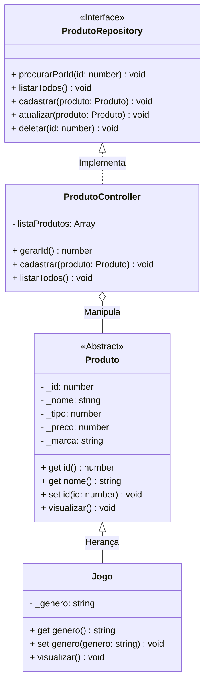

# Projeto Generation Games - TypeScript & POO

## Sistema de Gerenciamento de Loja de Jogos | Portfólio Profissional

<br />

<div align="center">
    
    
    
    
</div>

<br />

<div align="center">
  
  
  
  
</div>

---

<br />

O **Generation Games** é um projeto Fullstack desenvolvido em **TypeScript** como Avaliação Final do Bloco 01 do bootcamp da Generation Brasil. O software aplica conceitos avançados de **Programação Orientada a Objetos (POO)** e arquitetura modular, integrando o processamento de dados (Backend) com uma interface visual interativa (Frontend).

**Objetivo:** Validar a competência técnica no desenvolvimento de uma solução completa, unindo a lógica de programação, manipulação de dados e estruturação escalável no Backend, com a criação de um menu de interação e experiência do usuário via Terminal (CLI) no Frontend.

<br />

> [!NOTE]
> Este projeto foi desenvolvido **individualmente** como critério avaliativo, demonstrando autonomia na resolução de problemas e implementação de regras de negócio.

<br />

Este projeto foi estruturado para:

* Demonstrar **competência técnica em TypeScript** e Node.js
* Aplicar **POO** (Abstração, Encapsulamento, Herança e Polimorfismo)
* Evidenciar **arquitetura limpa** e organização de código
* Simular **regras de negócio** (validações, controle de estoque simulado)
* Servir como **case técnico para portfólio**

<br />

## Competências Técnicas Demonstradas

* Programação Orientada a Objetos
* Modelagem de domínio e Classes
* Arquitetura em camadas (**Model, Repository, Controller**)
* Tratamento de Encoding (**iconv-lite**)
* Interação via Terminal (**readline-sync**)
* Validação de entradas e controle de fluxo (`while`, `switch`)
* Clean Code e boas práticas

<br />

## Impacto Técnico e Métricas

| Indicador                     | Valor                            |
| ----------------------------- | -------------------------------- |
| Linhas de código              | +300                             |
| Classes principais            | 3 (Produto, Jogo, Controller)    |
| Funcionalidades implementadas | 5 (CRUD + Menu)                  |
| Conceitos POO aplicados       | Herança, Polimorfismo, Interface |
| Camadas arquiteturais         | Model, Repository, Controller    |
| Persistência                  | Simulada em memória              |
| Bibliotecas Externas          | 2 (Essenciais)                   |
| Tipo de Projeto               | **Individual**                   |

<br />

## Funcionalidades do Projeto

| Funcionalidade        | Status | Descrição                                   |
| --------------------- | ------ | ------------------------------------------- |
| **Cadastrar Produto** | ✅      | ID automático e trava de preço negativo     |
| **Listar Todos**      | ✅      | Polimorfismo no método visualizar           |
| **Listar por ID**     | ✅      | Busca indexada no array                     |
| **Atualizar Produto** | ✅      | **Smart Update:** Enter mantém valor antigo |
| **Deletar Produto**   | ✅      | **Exit Strategy:** Opção de cancelar ação   |
| **Menu Interativo**   | ✅      | CLI robusta e tratada                       |

<br />

## Diagrama de Classes



<br />

## Arquitetura do Projeto

Estrutura organizada para facilitar **manutenção, escalabilidade e leitura técnica**:

```text
📦 projeto_final_bloco_01
 ┣ 📂 src
 ┃ ┣ 📂 controller    # Regras de Negócio
 ┃ ┣ 📂 model         # Entidades (Classes)
 ┃ ┣ 📂 repository    # Contratos (Interfaces)
 ┃ ┗ 📂 util          # Configurações (Input/Output)
 ┣ 📜 Menu.ts         # Ponto de entrada (View)
 ┗ 📜 package.json    # Gerenciamento de Dependências
```

<br />

## Tecnologias Utilizadas

### Linguagem & Runtime

* TypeScript
* Node.js

### Bibliotecas

* `readline-sync` → Entrada de dados via terminal
* `iconv-lite` → Tratamento de caracteres especiais

### Ferramentas

* Git & GitHub
* VS Code
* Code Runner / ts-node

<br />

## Como Executar

### 1️⃣ Clone o repositório

```bash
git clone https://github.com/mwendellsmce/projeto_final_bloco_01.git
```

### 2️⃣ Acesse a pasta

```bash
cd projeto_final_bloco_01
```

### 3️⃣ Instale as dependências

```bash
npm install
```

### 4️⃣ Execute a aplicação

```bash
ts-node src/Menu.ts
```

Ou execute pelo **Code Runner** no VS Code (botão Play no `Menu.ts`).

<br />

## Implementações Futuras

* [ ] Persistência com banco de dados SQL
* [ ] Criação de API REST
* [ ] Novas classes filhas (Console, Periféricos)
* [ ] Sistema de Login

<br />

## Licença

Este projeto está sob licença **MIT** — livre para uso educacional e profissional.

<br />

## Autoria

**Projeto desenvolvido individualmente por Marcus Wendell**

*Desenvolvedor Full Stack em formação | Generation Brazil*

🔗 GitHub: [https://github.com/mwendellsmce](https://github.com/mwendellsmce)

🔗 LinkedIn: [https://www.linkedin.com/in/marcus-wendell](https://www.linkedin.com/in/marcus-wendell)

🔗 Email: [mwendelldev@gmail.com](mailto:mwendelldev@gmail.com)
